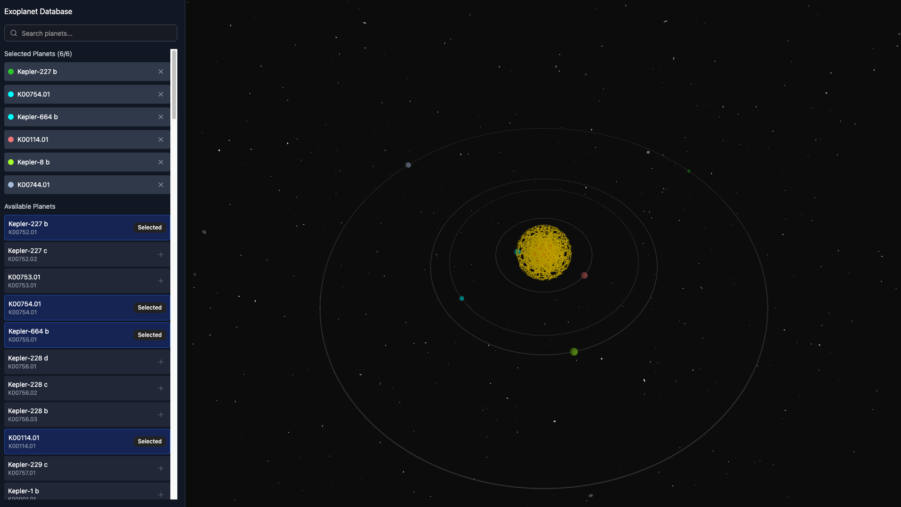
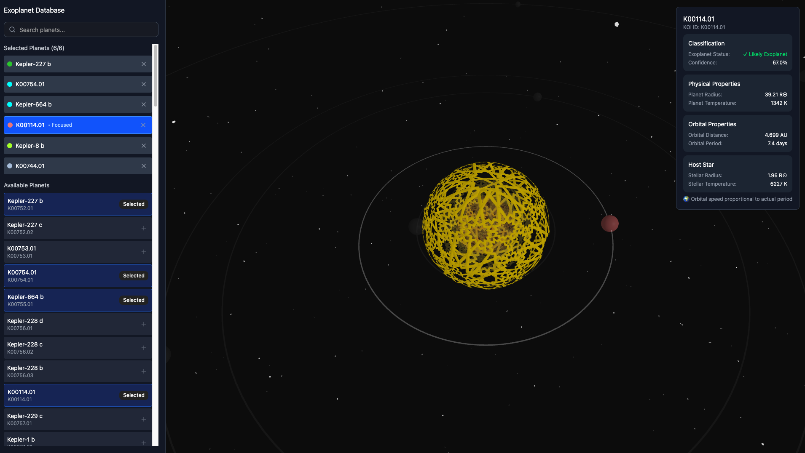

# ExoVis — Kepler Exoplanet Visualizer

Explore potential exoplanet transit events with an interactive, proportionally accurate 3D visualizer built on real NASA Kepler data. Built for the 2025 NASA Space Apps Hackathon.

[**Live site**](https://exovis.up.railway.app)

---

## Overview

ExoVis lets you compare up to **six** potential exoplanet events side by side. Each planet rendering uses consistent scales so that **orbital period**, **stellar radius**, **planet radius**, and **equilibrium temperature** are proportional to one another within the scene.  

Focus on any event by **clicking the rotating planet** in the canvas or by **selecting the item in the sidebar**. When focused, the UI reveals the full details for that candidate along with the **model estimated likelihood** that the event is an actual exoplanet and not another phenomenon.

This likelihood comes from a **Random Forest** classifier trained on the same NASA Kepler dataset that powers the visualization.

---

## Features

- Real Kepler-derived inputs used to drive the visualization scales for period, radii, and temperature
- Compare **up to 6** candidates at once
- Click-to-focus or select from a sidebar for detailed readouts
- Model probability from a trained **scikit-learn RandomForest**
- Smooth, interactive visuals using **React**, **TypeScript**, and **D3**
- Simple **FastAPI** backend that serves curated Kepler data and model results

---

## UI Preview

### ExoVis UI Without Focusing on a Specific Event



### ExoVis UI After Focusing on a Specific Event




---

## Architecture

```
frontend/           React + TypeScript + D3 visualizer
  └── src/
      ├── components/
      ├── hooks/
      ├── styles/
      └── api/      (API helpers, uses VITE_API_URL)
backend/            FastAPI + Python + scikit-learn model
  └── app/
      ├── main.py   (FastAPI app and routes)
      ├── model/    (joblib artifacts, scaler, feature list, version)
      └── data/     (processed Kepler CSVs or cache)
```

**Tech stack**

- Frontend: **TypeScript**, **React**, **D3**
- Backend: **Python**, **FastAPI**
- ML: **scikit-learn** RandomForest
- Data: NASA **Kepler** Objects of Interest derived tables

---

## How it works

1. **Data source**  
   We use derived tables from the **NASA Kepler mission** that include period, radii, temperature, and label information. These are preprocessed for the visualizer and inference.

2. **Model**  
   A **RandomForestClassifier** (scikit-learn) is trained on features selected from the Kepler dataset. We export the fitted model and preprocessor (for example a `StandardScaler`) as joblib artifacts.

3. **Serving**  
   The **FastAPI** service loads the artifacts on startup and exposes lightweight endpoints. The frontend queries these endpoints to populate the scene and the detail panel.

4. **Visualization**  
   React and D3 render a scene of up to six candidates. Scales are consistent so visual comparisons are meaningful across period, radii, and temperature.

---

## Getting started

### Prerequisites

- **Node.js** 18 or newer
- **Python** 3.10 or newer
- Recommended: **pip** or **uv**, and **virtualenv** or **venv**

### Backend setup

```bash
cd backend
python -m venv .venv
source .venv/bin/activate  # Windows: .venv\Scripts\activate
pip install -r requirements.txt
# optional: set MODEL_DIR to choose a model location
uvicorn app.main:app --reload --host 127.0.0.1 --port 8000
```

### Frontend setup

```bash
cd frontend
npm install
# Point the frontend to the API base. You can also use .env.local
export VITE_API_URL=http://127.0.0.1:8000
npm run dev
```

Visit `http://localhost:5173` while the backend runs at `http://127.0.0.1:8000`.

---

## API quick reference

> Field names may differ slightly depending on your processed dataset. Example shows common values used by the app.

### `GET /exoplanets`

Returns a list of candidate objects.

```json
[
  {
    "kepoi_name": "K00001.01",
    "orbital_period_days": 2.470613,
    "planet_radius_re": 1.13,
    "stellar_radius_rs": 0.92,
    "equilibrium_temp_k": 1050,
    "model_probability": 0.87
  }
]
```

### `GET /exoplanets/{kepoi_name}`

Returns full details for a single candidate, including any additional features used for display.

---

## Configuration

Environment variables commonly used by the app.

| Variable        | Where      | Purpose                                   | Example                    |
|-----------------|------------|-------------------------------------------|----------------------------|
| `VITE_API_URL`  | Frontend   | Base URL for the FastAPI service          | `http://127.0.0.1:8000`    |
| `MODEL_DIR`     | Backend    | Directory for model artifacts (optional)  | `app/model/exoplanet-v1`   |

---

## Data and model notes

- We use publicly available **NASA Kepler** mission data. Please review NASA data usage guidelines if you distribute derivatives.
- Visual scales are consistent within a scene so that relative comparisons are meaningful.
- The RandomForest outputs a probability-like score for exoplanet likelihood. This is a model estimate and not a definitive classification.

---

## Roadmap

- Export and share curated datasets used by the app
- Additional filters and sorting for the candidate list
- More visual encodings and labels for accessibility
- Option to pin a baseline candidate for frame of reference

---

## Contributors

- Liam Tanner  
- Callum Curtis  
- Nolan Curtis  
- Ben Towers  
- Yasmin Evans  
- Stephane Goulet

---

## Acknowledgements
 This Project was made possible by previous data and research from NASA and the Federal University of Itajuba.
  - [NASA Exoplanet Archive](https://exoplanetarchive.ipac.caltech.edu/cgi-bin/TblView/nph-tblView?app=ExoTbls&config=cumulative)
  - [Assessment of Ensemble-Based Machine Learning Algorithms for Exoplanet Identification](https://www.mdpi.com/2079-9292/13/19/3950)

---

